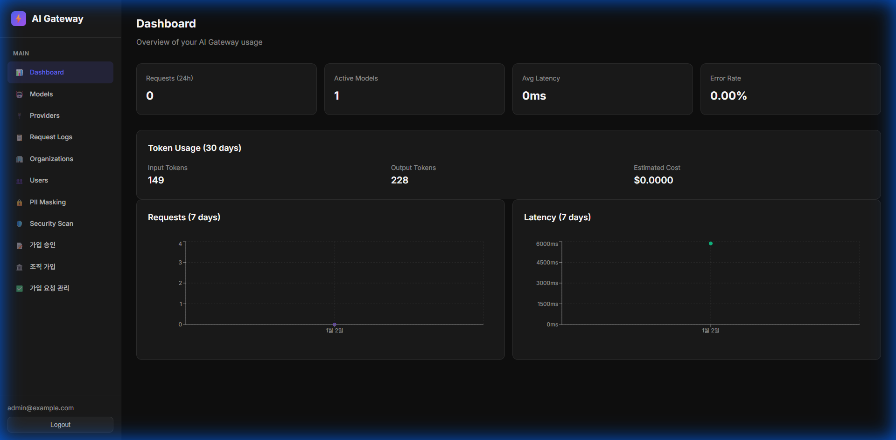
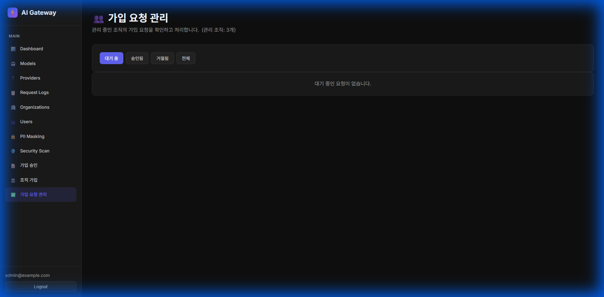
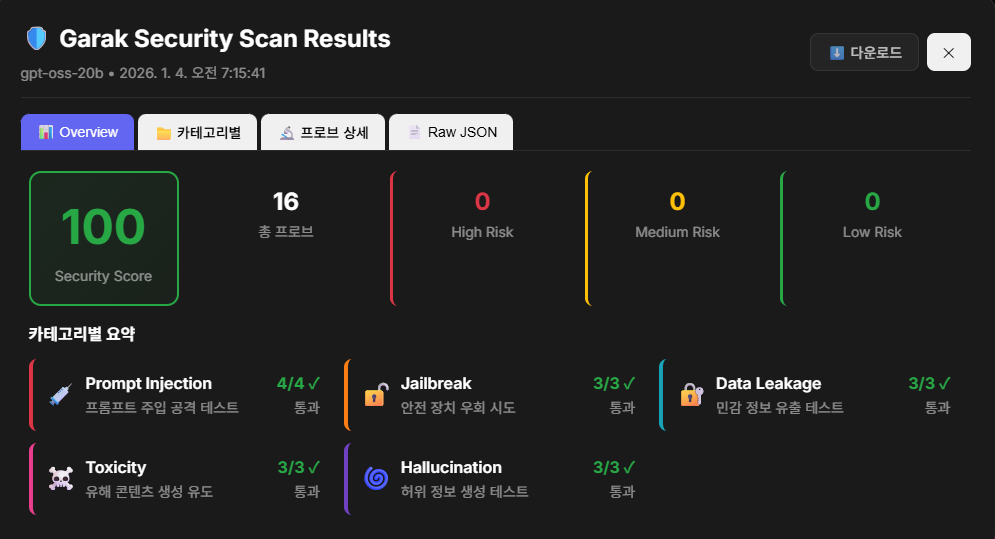

# AI Gateway

<div align="center">


**Enterprise-grade LLM Gateway Solution for Secure AI Operations**

[한국어 문서](./README.ko.md) | [API Documentation](./docs/api.md) | [Admin Guide](./docs/admin-guide.md) | [Installation Guide](./docs/offline-installation.md)

</div>

---

## Overview

AI Gateway is a comprehensive LLM (Large Language Model) gateway solution designed for enterprise environments. It provides a unified API interface compatible with OpenAI, supporting multiple LLM providers while offering robust security, access control, and monitoring capabilities.

### Key Features



| Category | Features |
|----------|----------|
| **API Compatibility** | OpenAI-compatible endpoints (`/v1/chat/completions`, `/v1/embeddings`) |
| **Multi-Provider** | Ollama, vLLM, OpenAI, Anthropic, Azure OpenAI, Custom endpoints |
| **Security** | AI Security scanning with Garak, PII detection & masking, Input/Output filtering |
| **Access Control** | User/Organization/Group-based permissions, API key management, SSO (OIDC) |
| **Monitoring** | Request/Response logging, Usage analytics dashboard, Real-time metrics |
| **Deployment** | Docker Compose, Offline installation support, Production-ready |

---

## Architecture

```
┌────────────────┐      ┌────────────────┐      ┌────────────────┐
│     Client     │─────▶│     Nginx      │─────▶│    FastAPI     │
│  (API/Admin)   │      │  (Reverse Proxy)│      │   (Backend)    │
└────────────────┘      └────────────────┘      └────────────────┘
                                                        │
               ┌────────────────────────────────────────┼────────────────┐
               │                    │                   │                │
        ┌──────▼──────┐     ┌───────▼──────┐    ┌──────▼──────┐  ┌──────▼──────┐
        │   Ollama    │     │     vLLM     │    │   OpenAI    │  │  PostgreSQL │
        │  (Local AI) │     │ (Self-hosted)│    │  (Cloud)    │  │  (Database) │
        └─────────────┘     └──────────────┘    └─────────────┘  └─────────────┘
                                                                         │
                                                                  ┌──────▼──────┐
                                                                  │    Redis    │
                                                                  │   (Cache)   │
                                                                  └─────────────┘
```

---

## Quick Start

### Prerequisites

- Docker 20.10+
- Docker Compose 2.0+
- 4GB+ RAM recommended

### Installation

```bash
# Clone repository
git clone https://github.com/your-org/ai-gateway.git
cd ai-gateway

# Configure environment
cp .env.example .env
# Edit .env file with your settings

# Start services
docker compose up -d

# Check status
docker compose ps
```

### Access Points

| Service | URL | Description |
|---------|-----|-------------|
| Admin UI | http://localhost:3000 | Web administration panel |
| API | http://localhost:8000/v1/ | OpenAI-compatible API |
| API Docs | http://localhost:8000/docs | Swagger documentation |

### Default Credentials

- **Email**: `admin@example.com`
- **Password**: `admin123`

> ⚠️ **Important**: Change default credentials in production!

---

## Configuration

### Environment Variables

| Variable | Description | Default |
|----------|-------------|---------|
| `SECRET_KEY` | Application secret key | `change-me-in-production` |
| `JWT_SECRET_KEY` | JWT signing key | `change-me-in-production` |
| `DB_PASSWORD` | PostgreSQL password | `password` |
| `ADMIN_EMAIL` | Initial admin email | `admin@example.com` |
| `ADMIN_PASSWORD` | Initial admin password | `admin123` |
| `DEBUG` | Debug mode | `false` |
| `LOG_LEVEL` | Logging level | `INFO` |

### Optional Features

```bash
# Enable security scanning (Garak)
docker compose --profile security up -d

# Production mode with Nginx
docker compose -f docker-compose.yml -f docker-compose.prod.yml up -d
```

---

## Usage

### 1. Register a Provider

Navigate to **Providers** → **Add Provider** in Admin UI:

```yaml
Name: my-ollama
Type: ollama
Base URL: http://ollama:11434
Auth Type: none
```

### 2. Register a Model

Navigate to **Models** → **Add Model**:

```yaml
Alias: llama3
Display Name: Llama 3 8B
Type: chat
Endpoints:
  - Provider: my-ollama
  - Model Name: llama3:8b
```

### 3. API Calls

```bash
# Get API Key from Admin UI → Users → API Keys

# Chat Completion
curl -X POST http://localhost:8000/v1/chat/completions \
  -H "Authorization: Bearer sk-your-api-key" \
  -H "Content-Type: application/json" \
  -d '{
    "model": "llama3",
    "messages": [{"role": "user", "content": "Hello!"}]
  }'

# Embeddings
curl -X POST http://localhost:8000/v1/embeddings \
  -H "Authorization: Bearer sk-your-api-key" \
  -H "Content-Type: application/json" \
  -d '{
    "model": "nomic-embed-text",
    "input": "Hello world"
  }'
```

---

## Features Detail

### Organization Management



- **Multi-Organization Support**: Users can belong to multiple organizations simultaneously
- **Role-Based Access**: Admin, Member roles per organization
- **Join Request System**: Request-based organization membership with approval workflow
- **Organization Groups**: Fine-grained model access control within organizations

### Security Features



- **AI Security Scanning**: Integrated Garak scanner for model vulnerability testing
- **PII Detection**: Automatic detection and masking of sensitive information
- **Request Filtering**: Input/output content filtering and moderation
- **Audit Logging**: Complete request/response logging for compliance

### Admin Dashboard

- **Usage Statistics**: Real-time usage charts and metrics
- **Model Health**: Endpoint availability monitoring
- **User Management**: User creation, API key management
- **Request Logs**: Searchable log viewer with CSV export

---

## Production Deployment

### Internet Environment

```bash
# 1. Clone and configure
git clone https://github.com/your-org/ai-gateway.git
cd ai-gateway
cp .env.example .env

# 2. Edit .env with production values
nano .env

# 3. Build and start with production profile
docker compose --profile security up -d --build

# 4. Set up reverse proxy (nginx/traefik) for HTTPS
```

### Security Recommendations

1. **Change all default passwords** in `.env`
2. **Enable HTTPS** via reverse proxy
3. **Configure firewall** to restrict port access
4. **Enable rate limiting** in production
5. **Regular backups** of PostgreSQL data

### Offline Installation

See [docs/offline-installation.md](./docs/offline-installation.md) for air-gapped environment setup.

---

## API Reference

### Authentication

All API requests require an API key in the Authorization header:

```
Authorization: Bearer sk-your-api-key
```

### Endpoints

| Method | Endpoint | Description |
|--------|----------|-------------|
| POST | `/v1/chat/completions` | Chat completion (OpenAI compatible) |
| POST | `/v1/embeddings` | Text embeddings |
| GET | `/v1/models` | List available models |
| GET | `/health` | Health check |

---

## Development

### Local Development

```bash
# Backend
cd backend
pip install -r requirements.txt
uvicorn app.main:app --reload

# Frontend
cd frontend
npm install
npm run dev
```

### Project Structure

```
ai-gateway/
├── backend/           # FastAPI backend
│   ├── app/
│   │   ├── api/       # API routes
│   │   ├── models/    # SQLAlchemy models
│   │   └── services/  # Business logic
│   └── Dockerfile
├── frontend/          # React admin UI
├── garak-service/     # Security scanner
├── nginx/             # Reverse proxy config
├── docs/              # Documentation
└── docker-compose.yml
```

---

## Troubleshooting

### Common Issues

| Issue | Solution |
|-------|----------|
| Database connection failed | Check PostgreSQL container health |
| Port already in use | Change port mapping in docker-compose.yml |
| API returns 401 | Verify API key is valid and not expired |
| Models not loading | Check provider endpoint connectivity |

### Logs

```bash
# View all logs
docker compose logs -f

# Backend only
docker logs ai_gateway_backend -f

# Database
docker logs ai_gateway_postgres -f
```

---

## Contributing

1. Fork the repository
2. Create a feature branch (`git checkout -b feature/amazing-feature`)
3. Commit changes (`git commit -m 'Add amazing feature'`)
4. Push to branch (`git push origin feature/amazing-feature`)
5. Open a Pull Request

---

## License

This project is licensed under the MIT License - see the [LICENSE](LICENSE) file for details.

---

## Support

- **Issues**: [GitHub Issues](https://github.com/your-org/ai-gateway/issues)
- **Discussions**: [GitHub Discussions](https://github.com/your-org/ai-gateway/discussions)
- **Email**: support@your-org.com
